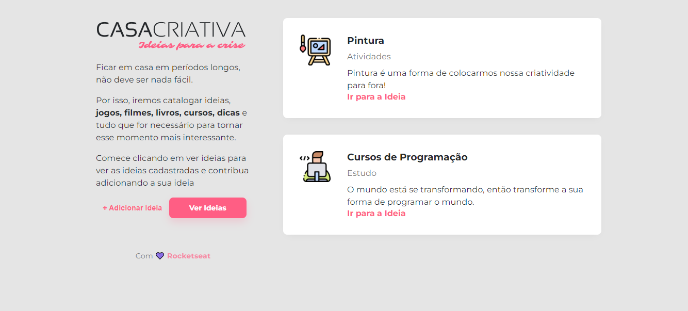
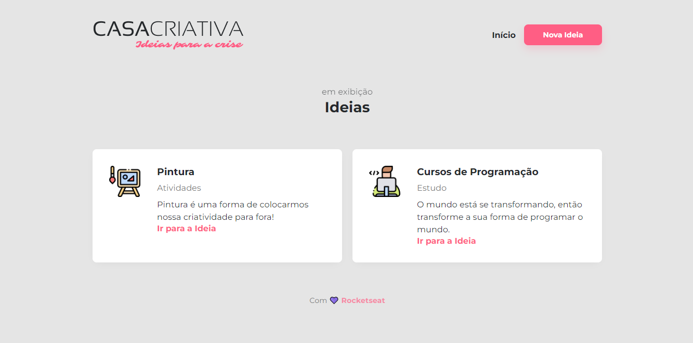
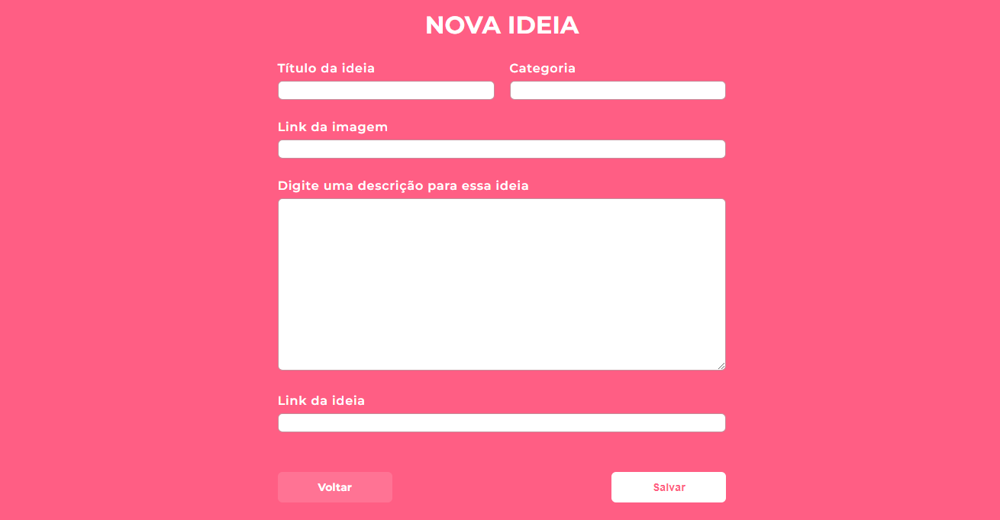

    

## 🖥️ Projeto 

O projeto é uma Aplicação Web para adicionar ideias de atividades para fazer em casa.

## 🚀 Tecnologias

| FRONT-END | BACK-END | DEPENDÊNCIAS |
|:---:|:---:|:---:|
| HTML | Node.js | Express |
| CSS | SQLite | Nunjucks |
| JavaScript | - | Sqlite3  |
| - | - | Nodemon  |

## 🏷️ Layout

Página Inicial

    

Página de Ideias

    

Página para Adicionar Ideias

    

## 🖱️ Como rodar a aplicação

Para rodar a aplicação você deve executar as seguintes tarefas:

- Clone ou baixe este repositório através [desse link](https://github.com/andreiafers/Casa-Criativa)

- Entre na pasta:

**cd Casa-Criativa**

- Instale as dependências:

**npm install**

- Rode a aplicação:

**npm dev run**

- Acesse a aplicação:

**http://localhost:3000 no seu navagador**

Feito por Andréia. ☕

